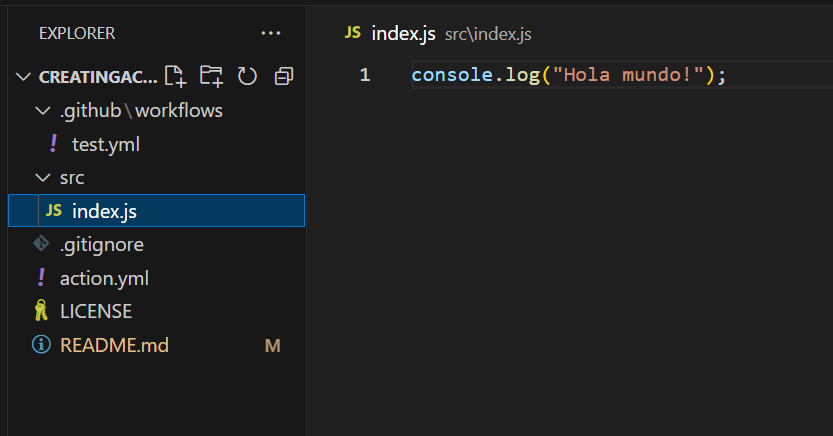
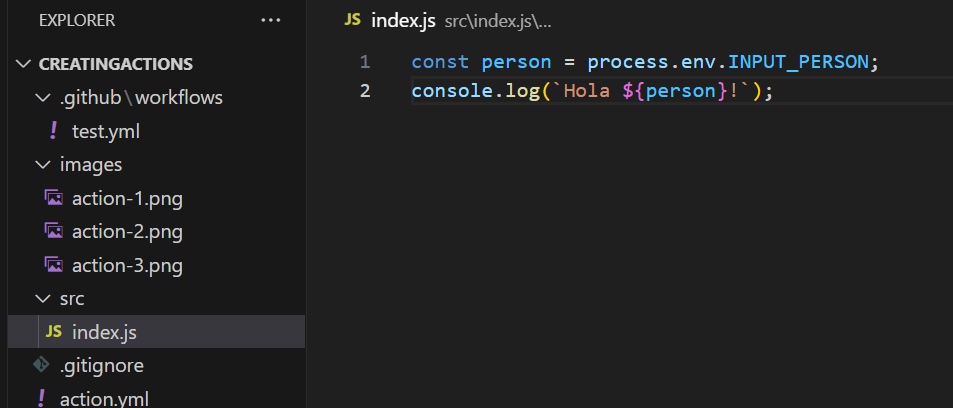

# DEMO PARA CREAR ACTIONS

En este repo aprendemos a construir y ejecutar una github action personalizada en js, muy sencilla, en nuestro pipeline de Github

### Qué es una github action?

Una GitHub Action es una herramienta de automatización que te permite definir flujos de trabajo personalizados, también conocidos como workflows, directamente en tu repositorio de GitHub. Estos workflows están compuestos por una serie de tareas individuales llamadas steps, que se ejecutan en respuesta a eventos específicos, como push, pull request, creación de etiquetas, entre otros.

Cada step en un workflow puede realizar una variedad de acciones, como ejecutar comandos en el sistema operativo, invocar scripts, llamar a APIs externas, desplegar aplicaciones, notificar a equipos, y más. Además, las GitHub Actions pueden interactuar con otros servicios y herramientas, permitiendo una integración profunda en tu pipeline de desarrollo y despliegue.


### Pasos:

- Lo primero que debemos hacer es crear un archivo con metadatos con el nombre de [action.yml](action.yml), en la que se almacena nuestra action y su función, a continuación se muestra el primer script de este archivo:

```
name: albertferal-action-personalizada #debe ser única y que no exista previamente
description: Esta action saluda a diversas personas
runs:
  using: node16
  main: src/index.js #archivo donde irá toda la lógica de nuestra action
```

- En el archivo [index.js](src\index.js) indicaremos todo lo que hará nuestra action al ejecutarse. En este caso es un sencillo print de la cadena "Hola mundo!".


    


- Para verificar su correcto funcionamiento debemos agregarla a un workflow, crearemos este [workflow](.github\workflows\test.yml) para que se ejecute al hacer un push en el repo.

```
name: Test

on: 
  push

jobs:
  test:
    runs-on: ubuntu-latest
    steps: 
      - uses: actions/checkout@v2
      - uses: actions/setup-node@v2
        with:
          node-version: 16
      - uses: ./ # con esto le decimos a github que busque el archivo action.yml y la ejecute
```
   - Este workflow llamado test, se ejecuta al hacer un push a cualquier rama del repositorio.
   - Definimos un job llamado test que ejecutará las siguientes acciones:
        - uses: actions/checkout@v2: Este paso utiliza la acción checkout de GitHub Actions para clonar el repositorio en el entorno de ejecución.
        - uses: actions/setup-node@v2: Este paso utiliza la acción setup-node de GitHub Actions para configurar un entorno de Node.js en el entorno de ejecución. Se establece la versión de Node.js en 16.
        - uses: ./: Este paso utiliza un archivo de acción local. En este caso, ./ se refiere al directorio actual, por lo que GitHub buscará un archivo action.yml en el mismo directorio que este archivo YAML. Esto uñtimo se hace para ejecutar una acción personalizada definida en el mismo repositorio.

#### Comprobar si nuestra action funciona correctamente

- En la consola o mediante VSC, ejecutamos:

```
git add .
```

```
git commit -m "mensaje del commit"
```

```
git push
```

- Tras estos 3 comandos, si accedemos a la interfaz de Github Actions, podremos ver nuestro pipeline, los pasos que ha ejecutado y la acción personalizada, tal como se muestra en las siguientes imágenes


## Mejorando la Action:

- Ahora modificaremos la action para añadirle un imput, de ese modo será un poco más versátil que un "Hola mundo!". Para ello hay que configurar de nuevo el script [action.yml](action.yml) y añadirle inputs, en este caso un input llamado "person", que tendrá las características "description", "required" y "default".

```
name: albertferal-action-personalizada #debe ser única y que no exista previamente
description: Esta action saluda a diversas personas
inputs:
  person:
    description: "Persona a la que saludar"
    required: True 
    default: ", no se quien eres pero me gustaría ver a Batman..." #en caso de no haber un input, saludará de este modo
runs:
  using: node16
  main: src/index.js #archivo donde irá toda la lógica de nuestra action
```

- También modificamos el archivo [index.js](src\index.js), quedando tal que así:

    

- En el pipeline también tenemos una pequeña modificación, hemos añadido otro "uses: ./" . Uno para no utilice el input y se genere con el de por defecto, y otro para que utilice el input generado "Batman"

```
name: Test

on: 
  push

jobs:
  test:
    runs-on: ubuntu-latest
    steps: 
      - uses: actions/checkout@v2
      - uses: actions/setup-node@v2
        with:
          node-version: 16
      - uses: ./ # con esto le decimos a github que busque el archivo action.yml y la ejecute // sin input
      - uses: ./ #con input
        with:
          person: "Batman"
```


- Hacemos un add, commit y push para verificar nuestra actions en el pipeline de Actions:

